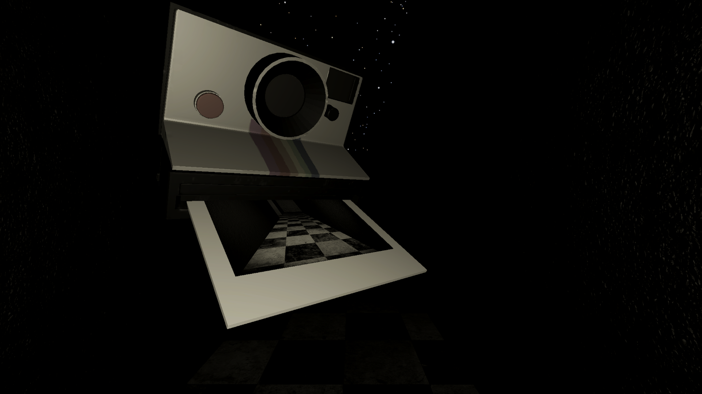

# Noctebris 

A puzzle, exploration, and survival horror mobile game where the player must navigate a completely dark labyrinth using only a camera and a hand-drawn map.

This was an academic project developed for the **Design de Jogos** (Game Design) course. The main goal was to explore innovative mobile mechanics, such as gyroscope usage, to create a deeply immersive and tense atmosphere.

## 🎮 About the Game

Stuck in a maze plunged into darkness, the player is driven by curiosity and the instinct for survival. To win, you must explore the environment, solve puzzles that block the path, manage your lives, and map the route to avoid getting lost. The game starts with 3 lives, which can be lost by failing challenges but are recoverable by finding healing points.

### ✨ Key Features and Learnings
* **Exploration in Darkness:** Navigate through an almost totally dark maze where the only source of orientation is the instant camera.
* **Manual Mapping:** Receive a blank map and manually draw your own route using "Pen" and "Eraser" tools, creating a deeper connection with the exploration.
* **Immersive Controls:** Use the mobile device's gyroscope for highly immersive, first-person camera control.
* **Interaction & Collision Systems:** Implementation of a three-part collision system: triggers for object interaction, colliders for environmental limits, and a raycast system to activate HUD buttons based on camera direction.
* **Puzzles and Items:** Solve logical enigmas and use special items to progress.

## 🎨 Visual Design and Engine

The game was developed exclusively for mobile (Android) using the **Unity** game engine. 
* It utilizes the **Universal Render Pipeline (URP)** to optimize 3D rendering and ensure device compatibility. 
* The visual identity focuses on an obscure 3D environment, playing with depth of field and pitch-black darkness to evoke fear of the unknown rather than relying on jumpscares.
  
Click here to see the [Noctebris - Design Book](Noctebris%-%Design%book.pdf)

## ⚙️ Controls

* **On-screen Joystick** - Character movement.
* **Device Gyroscope** - Camera rotation and direction.
* **PHOTO Button** - Takes a picture with flash; the image is revealed momentarily to show the path and is not saved.
* **MAP Button** - Opens and closes the manual mapping interface.
* **Contextual Button** - Appears dynamically when aiming at interactive objects.

## 🚀 YOU CAN PLAY THE DEMO

1. Download the Android build here: [DEMO](https://drive.google.com/file/d/1aIS7SafOo1aHi5ooXDYDItzcdbXoGiEe/view?usp=sharing)

## 📸 Visual Demonstration

|  |  |  |

|  |  |  |

---
*Academic project developed by: Rafael Lemos - Institution: Instituto Superior de Engenharia de Lisboa*
